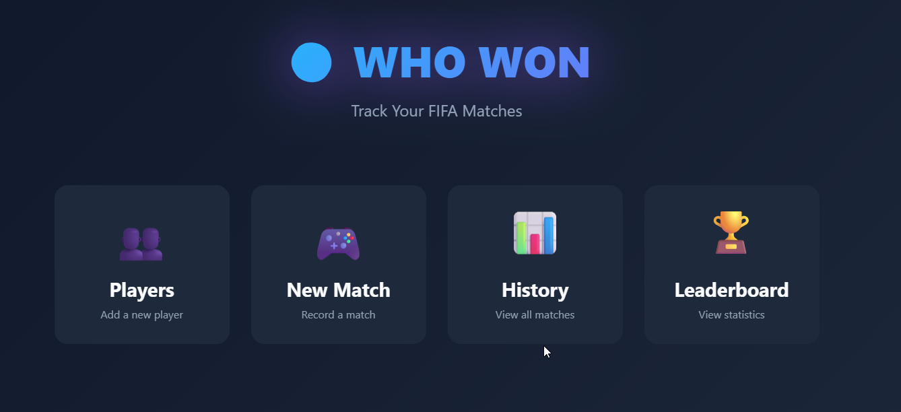
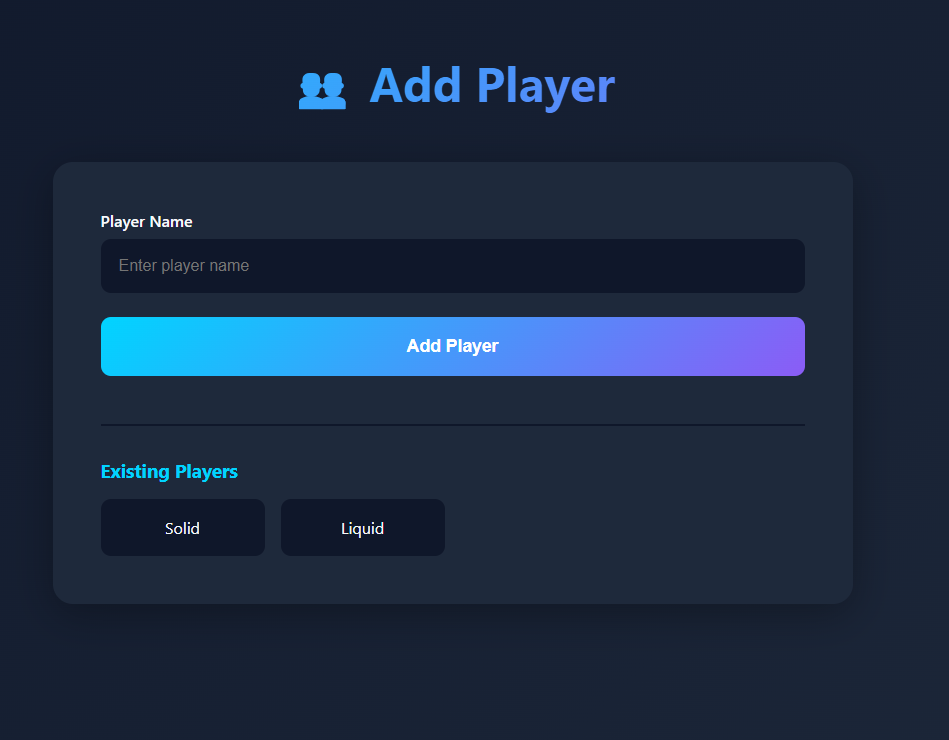
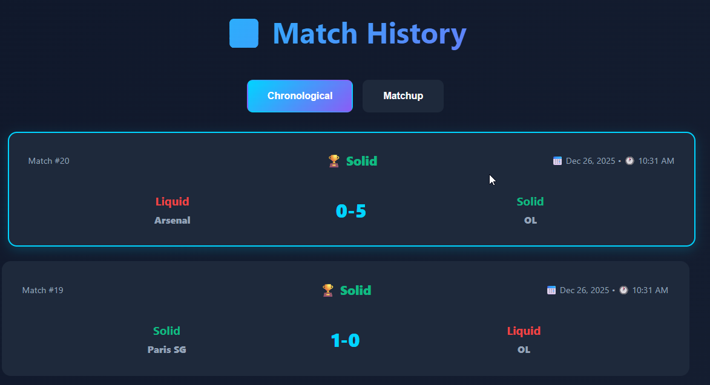
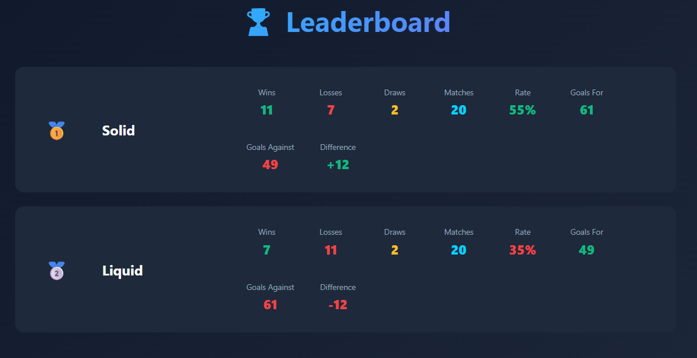

# ⚽ Who Won - FIFA Match Tracker

A modern web application to track FIFA game matches between players, with beautiful statistics and leaderboards.



## ✨ Features

- **Match Recording**: Two view modes (Classic & Card View) to record matches with teams and scores
- **Penalty Support**: Track penalty shootouts separately
- **Player Management**: Add and manage players with unique names
- **Match History**: 
  - Chronological view of all matches
  - Head-to-head matchup analysis with detailed statistics
  - Quick access suggestions for frequent matchups
- **Leaderboard**: Comprehensive player rankings with:
  - Wins, Losses, Draws
  - Win Rate with color indicators
  - Goals For/Against with color coding
  - Goal Difference
- **Auto Stats**: Player statistics automatically update after each match
- **Modern UI**: Dark theme with gradient effects and smooth animations

## 🚀 Tech Stack

- **Backend**: Flask 3.0.0 (Python)
- **Database**: SQLite with SQLAlchemy ORM
- **Frontend**: Vanilla JavaScript with modern CSS
- **Design**: Custom dark theme with gradient effects

## 📦 Installation

1. Clone the repository:
```bash
git clone https://github.com/Petouha/who-won.git
cd who-won
```

2. Install dependencies:
```bash
pip install -r requirements.txt
```

3. Run the application:
```bash
python app.py
```

4. Open your browser at `http://localhost:5000`

## 🎮 Usage

### Adding Players
1. Navigate to "Manage Players"
2. Enter a player name (must be unique)
3. Click "Add Player"



### Recording a Match

**Classic View (Legacy)**:
- Select both players from dropdowns
- Type team names (autocomplete available)
- Enter scores
- Toggle penalty shootout if needed

**Card View (Recommended)**:
- Click on two player cards to select them
- Choose teams from favorites or search
- Use +/- buttons to adjust scores
- Toggle the penalty button if needed
- Click "Save Match"

### Viewing Statistics

**Match History**:
- **Chronological**: See all matches in order with color-coded winners (green), losers (red), and draws (yellow)
- **Head-to-Head**: Select two players to see detailed matchup statistics including total games, win rates, and goals



**Leaderboard**:
- View all players ranked by win rate
- Color-coded statistics (green for positive, red for negative, yellow for draws)
- Comprehensive stats per player



## 🎨 Features Highlights

### Color-Coded Statistics
- **Green**: Wins, Goals For, Positive Difference, High Win Rate
- **Red**: Losses, Goals Against, Negative Difference, Low Win Rate
- **Yellow**: Draws
- **Blue**: Primary color for scores and highlights

### Smart Features
- **Autocomplete**: Team name suggestions while typing
- **Favorite Teams**: Quick access to frequently used teams per player
- **Duplicate Prevention**: Cannot create players with the same name (case-insensitive)
- **Auto Winner Detection**: Automatically determines match winner including penalty shootouts
- **Responsive Design**: Works on desktop and mobile devices

## 📝 API Endpoints

- `GET /`: Home page
- `GET /players`: Get all players
- `POST /players`: Add new player
- `GET /games`: Get all matches
- `POST /games`: Create new match
- `GET /leaderboard`: Get player rankings
- `GET /api/teams`: Get all available teams
- `GET /api/favorite-teams/<player_id>`: Get player's favorite teams

## 🤝 Contributing

Feel free to open issues or submit pull requests!

